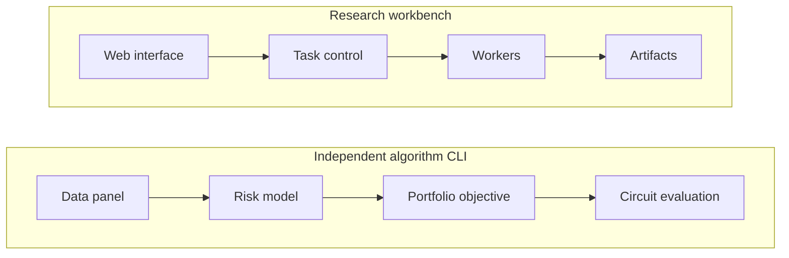

# Q-Fintelligence · 量融智枢

**A research workbench for risk-aware portfolio optimization and adaptive quantum circuits.**

[简体中文](README_zh.md) · [Product](https://qfintelligence.yuxuan.wiki/) · [Research cases](docs/research.md) · [Reproduction](docs/reproduction.md) · [Evidence](evidence/README.md)

Q-Fintelligence connects financial information available at a decision time, classical risk estimates, local quantum representations, and constrained portfolio objectives. It combines a Web research workbench with the QF Algorithm 2.1.0 Python source and selected, traceable experimental results.

This is an ongoing research project with a deployed product entry and archived experiments. Results vary by task: some quantum configurations improve a selected baseline, while stronger classical methods perform better in several comparisons. The published evidence makes those conditions inspectable.

## Architecture at a glance



The workbench and algorithm CLI are separate entry points. Their integration status and source locations are described in [Architecture](docs/architecture.md).

## What you can learn here

- Follow expected returns, covariance and trading costs into an equivalent QUBO/Ising objective.
- Examine how quantum local features are compared with classical predictors on a shared information set.
- Trace a six-qubit circuit from ideal simulation to noisy simulation and real-device counts.
- Study task state, event replay, artifact identity and human approval in a scientific agent workbench.

## Read in three depths

| Time | Start | Outcome |
|---|---|---|
| 5 minutes | This page and the [research map](docs/research.md) | Understand the question, contributions and actual results |
| 30 minutes | Three [worked cases](docs/research.md#worked-cases) and their notebooks | Inspect the equations, comparisons and failure mechanisms |
| Reproduction session | [Environment and validation guide](docs/reproduction.md) | Run the small offline checks; prepare a supported development environment |

## Project layers

| Layer | Included material | Current status | Next useful contribution |
|---|---|---|---|
| Product | [Web, control plane, workers and contracts](product/) | Deployed entry; source snapshot included | Verify the documented mock workflow on clean Linux/WSL2 |
| Algorithm | [QF Algorithm 2.1.0](algorithm/) | Versioned Python/CLI source; synthetic input path | Check the minimal synthetic method chain in a clean environment |
| Experiments | [E01–E07 and hardware/cloud evidence](evidence/) | Selected archived results, with source hashes | Review one claim against its task, endpoint and comparison |
| Learning | [Three notebooks](notebooks/) | Small public teaching examples; cleared execution metadata | Improve an explanation while preserving the mathematical contract |
| Research record | [Architecture](docs/architecture.md), [status](docs/status.md), [contribution scope](docs/contributions.md) | Maintained alongside the source | Document a design tradeoff and its validation |

## Selected evidence

The numerical archive below covers experiments recorded on 7–9 September 2026. Values describe those frozen tasks. They are neither a return forecast nor a general quantum-advantage claim.

| Study | Evidence | Interpretation |
|---|---|---|
| E01 objective identity | 60 synthetic cases, 12,516 binary states; maximum error `4.16e-17` | Numerical agreement of the registered objective representations |
| E02 feature mapping | 576 dates × 5 seeds; selected-minus-classical MAE `−0.0005830` | Improvement on this five-session downside-risk task; selected and fixed maps coincide |
| E03 local graph message | 485 dates × 5 seeds; quantum-minus-classical MAE `+0.00008834` | The classical reference performs better on this stock-return task |
| E05 small portfolio search | 27 fixed objectives; QAOA gap difference `−0.0016276` vs uniform, `+0.0024316` vs local search | Better than uniform sampling, worse than the classical search reference |
| E06 noise-aware selection | 8 base problems; interval overlaps zero vs fixed selection | The archive does not establish an improvement over fixed selection |
| E07 financial endpoint | CVaR95 `0.0369492` for the integrated method vs `0.0275373` for classical, at cost `0.001` | Higher tail loss in this comparison; integrated and fixed-map outcomes coincide |
| Hardware transfer | 1,000 six-qubit circuits, 1,024,000 hardware shots; 999 valid matched cloud simulations | Real-device transfer can be studied under one observed calibration snapshot |

See the [evidence guide](evidence/README.md) for sample units, uncertainty, field selection and the distinction between archived and newly executed checks. A device name indicates the platform; the tested circuits here use six qubits.

## First practical step

These two small checks use Python's standard library and make no provider calls:

```bash
python examples/bridge_identity.py
python tools/verify_public_evidence.py
```

The first enumerates a synthetic six-asset objective in three representations. The second recomputes selected summary statistics from the public tables. For the workbench and algorithm installation, follow [Reproduction](docs/reproduction.md).

## Design and contribution

Julius designed the experiments, product architecture and model architecture. Implementation, deployment and experiment execution belong to the project's implementation workflow and are credited separately from those design responsibilities. See [Contribution scope](docs/contributions.md) for how we record individual work and upstream dependencies.

The teaching structure moves from prerequisites to a worked example, an inspectable result and a contribution task. Readers can start with [one evidence review](docs/contributions.md#first-contribution), then use the repository's [contribution guidelines](CONTRIBUTING.md).

## License and sources

Original code is covered by [MIT](LICENSE). Original documentation is covered by [CC BY-NC-SA 4.0](LICENSE-DOCS.txt). Third-party components retain their licenses; see [Third-party notices](THIRD_PARTY_NOTICES.md). Source market data and complete private execution records are outside this edition; the included selected summaries have their own [data notice](evidence/DATA_NOTICE.md).
