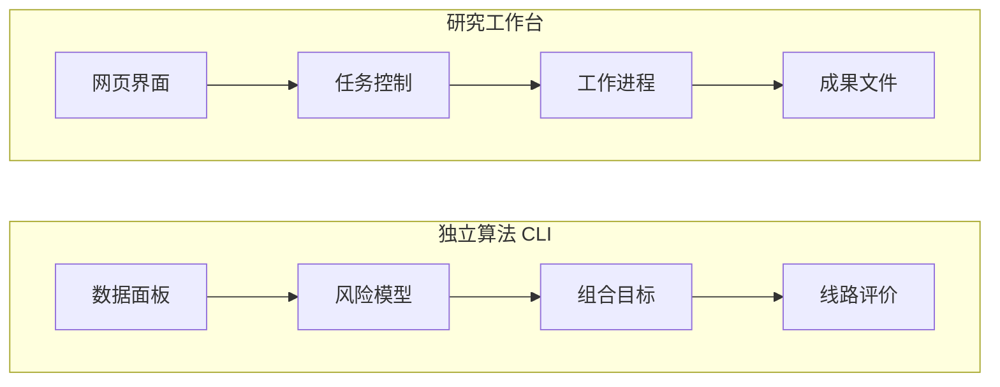

# Q-Fintelligence · 量融智枢

**面向风控增强投资组合优化与量子线路自适应设计的研究工作台。**

[English](README.md) · [产品入口](https://qfintelligence.yuxuan.wiki/) · [研究案例](docs/research_zh.md) · [复现指南](docs/reproduction_zh.md) · [实验证据](evidence/README_zh.md)

量融智枢将决策时点可见的金融信息、经典风险估计、局部量子表征与受约束组合目标连接起来。本仓库包含 Web 科研工作台、QF Algorithm 2.1.0 Python 源码以及经过筛选、可以追溯的实验结果。

项目处于持续研究阶段，已有云端产品入口和归档实验。结果随任务而变化：部分量子配置改善了某个对照，而更强的经典方法在若干比较中表现更好。公开证据使这些适用条件可以被检查。

## 架构概览



工作台与算法 CLI 是两个独立入口，集成状态和源码位置见[架构说明](docs/architecture_zh.md)。

## 可以在这里学到什么

- 将预期收益、协方差与交易成本推导为等价的 QUBO/Ising 目标。
- 检查量子局部特征如何在共同信息集下与经典预测器比较。
- 追踪六比特线路从理想模拟、含噪模拟到真实设备计数的变化。
- 研究科研智能体工作台的任务状态、事件重放、工件身份与人工审批。

## 三种阅读深度

| 时间 | 入口 | 预期收获 |
|---|---|---|
| 5 分钟 | 本页和[研究地图](docs/research_zh.md) | 理解问题、贡献及真实结果 |
| 30 分钟 | 三个[深入案例](docs/research_zh.md#深入案例)及其 Notebook | 检查公式、比较方法和失效机制 |
| 一次复现实践 | [环境与验证指南](docs/reproduction_zh.md) | 运行小型离线检查，并准备受支持的开发环境 |

## 项目层次

| 层次 | 已有内容 | 当前状态 | 下一项有价值的贡献 |
|---|---|---|---|
| 产品 | [Web、控制面、worker 与接口合同](product/) | 云端入口已部署；包含源码快照 | 在干净 Linux/WSL2 环境验证文档中的 mock 流程 |
| 算法 | [QF Algorithm 2.1.0](algorithm/) | 版本化 Python/CLI 源码；具有合成输入路径 | 在干净环境检查最小合成方法链 |
| 实验 | [E01–E07 与硬件/云端证据](evidence/) | 筛选后的归档结果，保留来源哈希 | 对照任务、终点与参照对象复核一条表述 |
| 学习 | [三个 Notebook](notebooks/) | 小型公开教学示例；执行元数据已清理 | 在保持数学定义的前提下改善解释 |
| 研究记录 | [架构](docs/architecture_zh.md)、[状态](docs/status_zh.md)、[贡献范围](docs/contributions_zh.md) | 与源码同步维护 | 记录一项设计取舍及其验证 |

## 代表性证据

下表来自 2026 年 9 月 7—9 日记录的实验，数值对应各自冻结任务。它们不能用于收益预测，也不构成一般性的量子优势结论。

| 研究 | 证据 | 解释 |
|---|---|---|
| E01 目标一致性 | 60 个合成案例、12,516 个二元状态；最大误差 `4.16e-17` | 已登记目标表达之间的数值一致性 |
| E02 特征映射 | 576 日期 × 5 种子；选定映射减经典映射的 MAE 为 `−0.0005830` | 在该五期下行风险任务上有改善；选定与固定映射重合 |
| E03 局部图消息 | 485 日期 × 5 种子；量子减经典的 MAE 为 `+0.00008834` | 在该股票收益任务上，经典参照更好 |
| E05 小规模组合搜索 | 27 个冻结目标；QAOA 相对均匀参照的差距变化 `−0.0016276`，相对局部搜索为 `+0.0024316` | 好于均匀抽样，弱于经典搜索参照 |
| E06 噪声感知选择 | 8 个基础问题；相对固定选择的区间跨越零 | 归档结果尚未建立相对固定选择的改善 |
| E07 金融终点 | 成本 `0.001` 时，完整方法 CVaR95 为 `0.0369492`，经典方法为 `0.0275373` | 该比较中尾部损失更高；完整与固定映射结果重合 |
| 硬件迁移 | 1,000 条六比特线路、1,024,000 次硬件测量；999 条有效配对云模拟 | 可在一个已观测校准快照下研究真实设备迁移 |

[证据导读](evidence/README_zh.md)说明样本单位、不确定性、字段筛选及归档与本轮检查的区别。设备名称表示平台，本文这些实测线路使用六个量子比特。

## 第一次实践

以下两个小型检查只使用 Python 标准库，不调用外部服务：

```bash
python examples/bridge_identity.py
python tools/verify_public_evidence.py
```

第一个将合成六资产目标用三种表达逐态枚举；第二个从公开表格重新计算选定汇总值。工作台和算法安装请使用[复现指南](docs/reproduction_zh.md)。

## 设计与贡献

Julius 负责实验设计、产品架构设计与模型架构设计。代码实现、部署及实验执行属于项目的实施流程，与上述设计职责分别记录。[贡献范围](docs/contributions_zh.md)说明个人工作和上游依赖的归属方式。

教学结构从前置知识进入具体案例、可检查的结果和贡献任务。读者可以先完成[一次证据复核](docs/contributions_zh.md#第一次贡献)，再按照[协作指南](CONTRIBUTING.zh-CN.md)提交。

## 许可与来源

原创代码采用 [MIT](LICENSE)，原创文档采用 [CC BY-NC-SA 4.0](LICENSE-DOCS.txt)。第三方组件保持各自许可，见[第三方声明](THIRD_PARTY_NOTICES.md)。本版本不包含原始行情及完整内部执行记录；已公开的筛选汇总值适用单独的[数据说明](evidence/DATA_NOTICE.md)。
