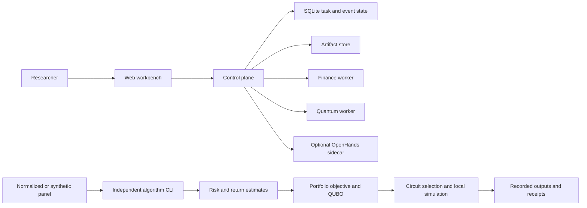

# Architecture and source map

[中文](architecture_zh.md) · [Home](../README.md) · [Research](research.md)

The public source has two complementary entry points. The product is a workbench for human review, orchestration and artifact management. The algorithm package is an independent Python method chain. Their concepts and contracts overlap; this edition does not establish that every algorithm entry point is connected to a deployed UI action.

## System boundaries

### Product

| Source | Responsibility | Review question |
|---|---|---|
| [Web](../product/apps/web/) | Research UI, task progress and review surfaces | Does the displayed state match the persisted task? |
| [Control plane](../product/apps/control-plane/src/) | Routing, orchestration, campaign state and provider policy | Can an interrupted task resume without duplicate external actions? |
| [Contracts](../product/packages/contracts/) | Shared schemas and type boundaries | Can a malformed artifact cross the boundary? |
| [Artifact store](../product/apps/control-plane/src/artifact-store.ts) | Identity and artifact persistence | Are output identity and lineage inspectable? |
| [Workers](../product/workers/) | Finance, quantum and isolated agent capabilities | Which dependencies and permissions does each worker need? |
| [Infrastructure](../product/infra/) | SQLite migrations, WSL checks and sidecar support | Can a clean environment reproduce the documented mock path? |

The workbench defaults to mock configuration. Optional provider and hardware modes introduce credentials, external state and cost. Their explicit configuration is part of an operator's environment. The OpenHands derivative has a pinned source commit, patch, wheel and notices in its [supply-chain directory](../product/workers/openhands_sidecar/supply_chain/).

### Algorithm

| Source | Responsibility | Important contract |
|---|---|---|
| [data.py](../algorithm/qf_algorithm/data.py) | Normalize panels and supply synthetic input | Asset ordering, label availability and date alignment |
| [pipeline.py](../algorithm/qf_algorithm/pipeline.py) | Coordinate the method chain and write artifacts | Training dates precede evaluation with label-availability purging |
| [risk.py](../algorithm/qf_algorithm/risk.py) | Risk-model choices | Units and covariance positive semidefiniteness |
| [legacy/bridge.py](../algorithm/qf_algorithm/legacy/bridge.py) | Portfolio, QUBO and Ising representations | Constants, binary convention and cardinality penalty |
| [quantum.py](../algorithm/qf_algorithm/quantum.py) | Candidates, local simulation and count metrics | Bit order, feasibility, resource counts and execution mode |
| [selection.py](../algorithm/qf_algorithm/selection.py) | Local proxy and constrained decisions | Candidate identity and allowed decision schema |
| [governance.py](../algorithm/qf_algorithm/governance.py) | Receipt auditing | Receipt structure alone does not prove external execution |

The default chain constructs local synthetic data when no input or frozen-data option is supplied. It fits models and simulates candidates, so it is a more substantial run than the public standard-library examples. Historical analysis and compatibility commands require archive layouts outside this publication.

## Design decisions worth studying

1. **Persist evidence alongside state.** A successful task status is useful when its artifact and configuration can be located. Task events and artifacts are separate objects whose relationship can be inspected.
2. **Keep financial and hardware claims separate.** A hardware receipt demonstrates circuit execution. Financial utility requires an information-set contract, reference method, date split and endpoint.
3. **Compare shared objectives.** Small six-asset problems permit exact enumeration, helping distinguish representation error, optimizer quality and device noise.
4. **Record execution mode.** A local proxy decision and a hardware-backed result have different provenance.

## Integration task

Choose one UI workflow, identify its request schema, worker call, persisted state and output artifact, then compare that artifact with the algorithm CLI schema. Provide a mock example and compatibility test before proposing an integration. See [contributions](contributions.md).
