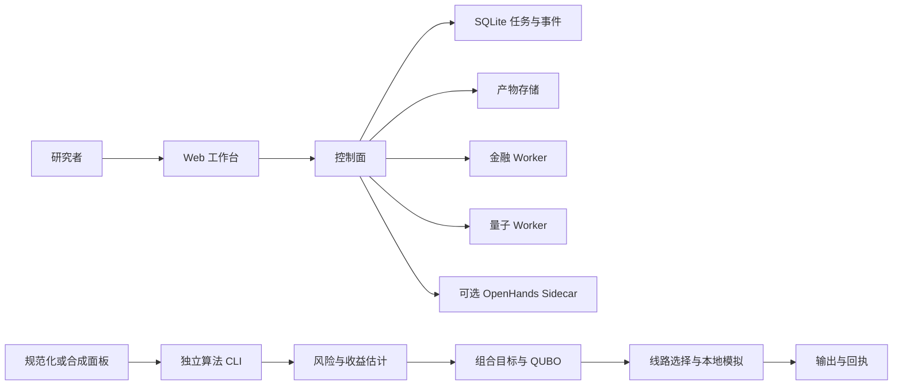

# 架构与源码导航

[English](architecture.md) · [首页](../README_zh.md) · [研究导航](research_zh.md)

公开源码有两个互补入口：产品工作台负责人工审阅、任务编排与产物管理；算法软件是独立的 Python 方法链。两者共享部分概念与合同，本版尚未证明每个算法入口都已连接到已部署界面的操作。

## 系统边界

### 产品层

| 源码入口 | 职责 | 审阅问题 |
|---|---|---|
| [Web](../product/apps/web/) | 研究界面、进度与审阅入口 | 展示状态是否对应持久化任务？ |
| [控制面](../product/apps/control-plane/src/) | 路由、任务编排、实验状态与服务策略 | 中断恢复是否重复触发外部操作？ |
| [共享合同](../product/packages/contracts/) | Schema 与类型边界 | 非法产物是否可能越过边界？ |
| [产物存储](../product/apps/control-plane/src/artifact-store.ts) | 产物身份与持久化 | 能否检查输出身份与来源链？ |
| [Workers](../product/workers/) | 金融、量子与隔离 Agent 能力 | 每个执行单元需要哪些依赖和权限？ |
| [基础设施](../product/infra/) | SQLite、WSL 检查与 Sidecar 支持 | 全新环境能否复现文档中的 mock 路径？ |

默认配置使用 mock。可选模型服务与硬件模式涉及凭据、外部状态和费用，需要操作者明确配置。OpenHands 派生组件在[供应链目录](../product/workers/openhands_sidecar/supply_chain/)保留固定源码提交、补丁、wheel 与权利声明。

### 算法层

| 源码入口 | 职责 | 关键约束 |
|---|---|---|
| [data.py](../algorithm/qf_algorithm/data.py) | 规范化数据与合成输入 | 资产顺序、标签可用时间、日期对齐 |
| [pipeline.py](../algorithm/qf_algorithm/pipeline.py) | 串联方法并记录产物 | 训练日期与标签可用日期满足时间外评估要求 |
| [risk.py](../algorithm/qf_algorithm/risk.py) | 风险模型选择 | 单位与协方差半正定性 |
| [legacy/bridge.py](../algorithm/qf_algorithm/legacy/bridge.py) | 组合、QUBO 与 Ising 表示 | 常数项、二进制约定、基数惩罚 |
| [quantum.py](../algorithm/qf_algorithm/quantum.py) | 候选线路、本地模拟与 counts 指标 | 位序、可行性、资源与执行模式 |
| [selection.py](../algorithm/qf_algorithm/selection.py) | 本地代理与受约束决策 | 候选身份与允许的决策 Schema |
| [governance.py](../algorithm/qf_algorithm/governance.py) | 回执审计 | 回执结构正确本身不证明外部执行发生 |

未提供输入或冻结数据选项时，方法链生成本地合成数据。该路径会拟合模型并模拟候选，工作量高于公开标准库示例。历史统计与兼容入口依赖本版未包含的归档结构。

## 值得学习的设计取舍

1. **状态与证据共同保存。** 成功状态要能定位产物与配置；任务事件和产物分别建模，便于检查二者关系。
2. **金融结论与硬件结论分开建立。** 硬件回执支持线路执行事实；金融效用还需要信息集、基线、日期切分与端点。
3. **比较同一个目标。** 六资产问题可精确枚举，有助于区分表示错误、求解器表现和设备噪声。
4. **记录执行模式。** 本地代理决策和硬件结果的来源不同，产物应保留这一区别。

## 可参与的集成任务

选择一个界面流程，画出请求 Schema、Worker 调用、持久化状态与输出产物的对应关系，再与算法 CLI 产物 Schema 比较。先提交 mock 示例和兼容性测试，再提出集成方案。参见[贡献入口](contributions_zh.md)。

## 量子表示源码路径

E02 使用[保真度核](../algorithm/qf_algorithm/legacy/quantum_features.py)与[锚点回归](../algorithm/qf_algorithm/legacy/run_e02.py)。E03 使用同一特征文件的 Z/ZZ 读出，再交给[经典图预测头](../algorithm/qf_algorithm/legacy/graph_head.py)。两条路径共享部分线路定义，但服务不同任务。[案例 02](cases/02-representations_zh.md)解释公式、选择控制与资源范围。产品/Agent 架构支撑实验组织，其评价与量子方法主张分别记录。
