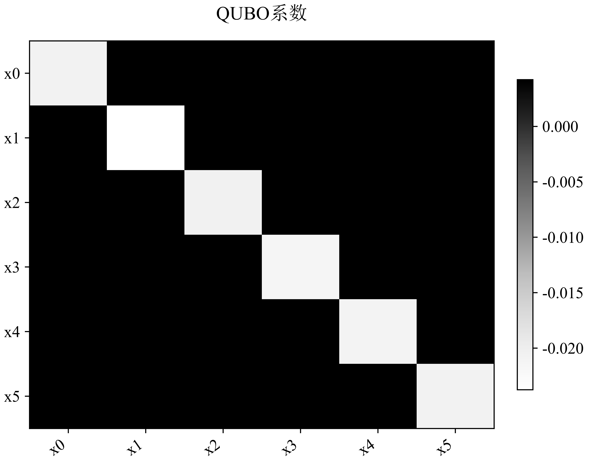
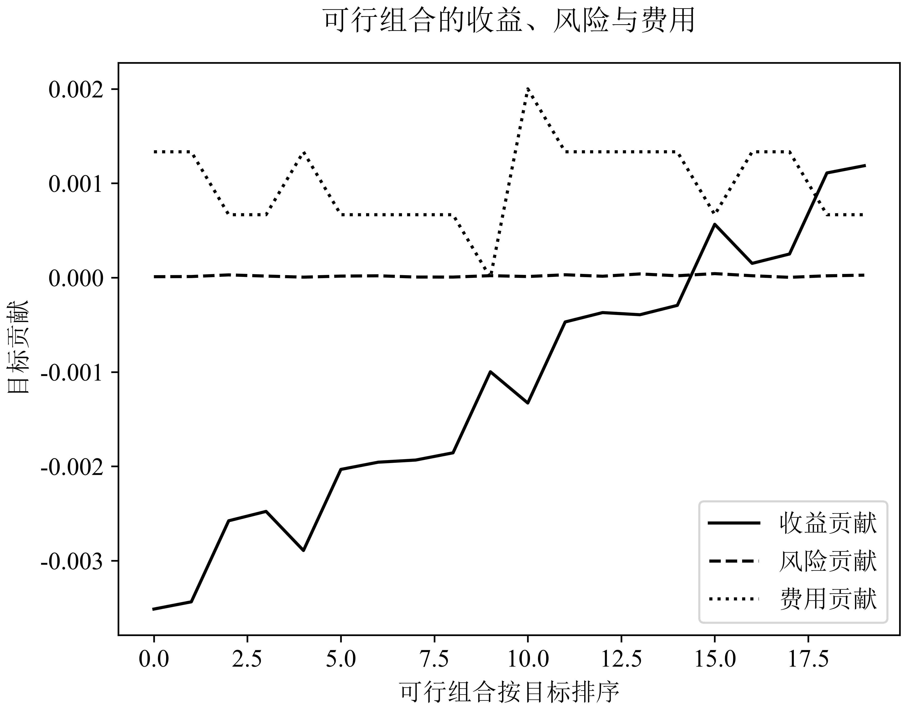
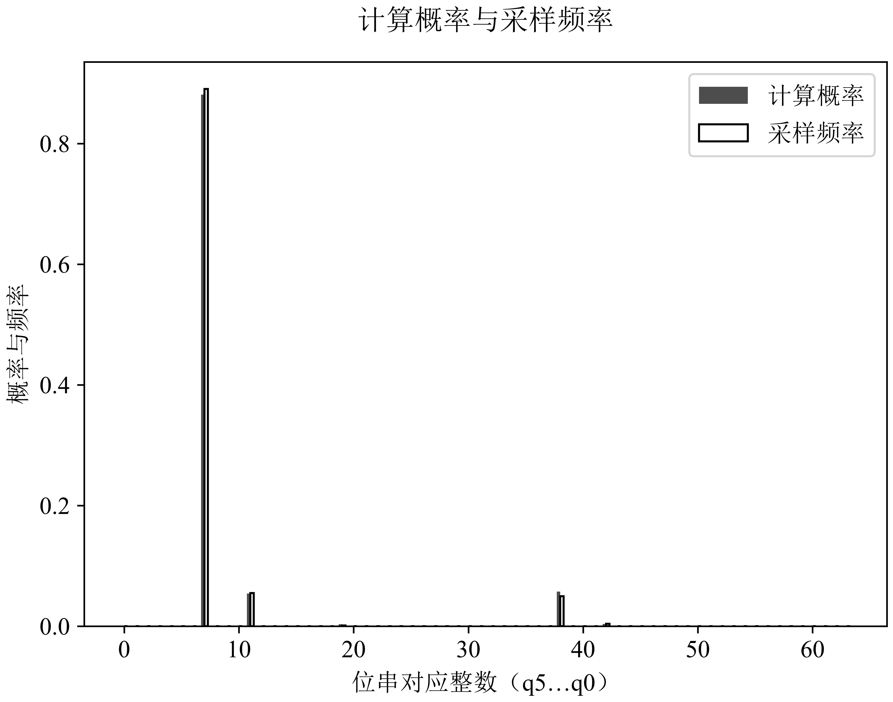
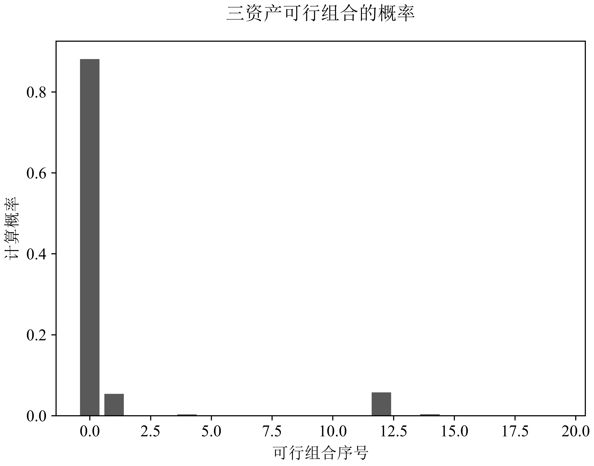

# Case 01 · Preserve a financial objective through QUBO and Ising

[中文](01-objective_zh.md) · [Research map](../research.md) · [Notebook](../../notebooks/01_objective_identity.ipynb)

## Prerequisites

Read vectors and quadratic forms, expected return, covariance, and a binary selection variable. The fixed-cardinality example below uses equal weights; it can be followed without quantum mechanics.

## Learning outcome and evidence route

After this case, you should be able to derive a binary objective, translate the matrix storage convention, and explain why a good sampled bitstring is insufficient to assess a quantum solver. Read the algebra first, inspect the original figures, then compare the E01 identity checks and E05 solver results. The small notebook is an optional arithmetic companion; the figures and results below come from existing archives.

## The question

A quantum optimizer can minimize the wrong financial objective perfectly. Before comparing optimizers, the return units, covariance horizon, asset order, previous holdings and cardinality must describe the same decision. This case tests that interface.

For binary selections $`x_i\in\lbrace 0,1\rbrace `$ with $`\sum_i x_i=K`$, equal weights are $`w=x/K`$. Let $`\mu`$ be expected simple returns, $`\Sigma`$ a symmetric covariance matrix for the same horizon, $`v`$ the actual previous weights, $`\lambda`$ risk aversion and $`c`$ the cost per unit turnover:

```math
J(x)=-\mu^Tx/K+\lambda x^T\Sigma x/K^2+c\sum_i|x_i/K-v_i|.
```

Keeping the factors $`1/K`$ and $`1/K^2`$ matters: changing them changes the tradeoff between mean and risk. A cash position or an asset that has left the eligible universe also changes the previous-holdings accounting.

## Exact transformation

Because $`x_i`$ takes only two values,

```math
|x_i/K-v_i|=|v_i|+x_i\left(|1/K-v_i|-|v_i|\right).
```

Thus the cost term is affine in each binary variable. Add $`\kappa(\sum_i x_i-K)^2`$ when the solver works on the full binary domain. Using an upper-triangular QUBO convention,

```math
C(x)=C_0+\sum_iQ_{ii}x_i+\sum_{i\lt j}Q_{ij}x_ix_j,
```

```math
Q_{ii}=-\mu_i/K+\lambda\Sigma_{ii}/K^2+c(|1/K-v_i|-|v_i|)+\kappa(1-2K),
```

```math
Q_{ij}=2\lambda\Sigma_{ij}/K^2+2\kappa,\quad C_0=c\sum_i|v_i|+\kappa K^2.
```

The factor two for off-diagonal covariance comes from the symmetric quadratic form. A full symmetric matrix representation requires a different storage convention; copying these coefficients without that distinction doubles interactions.

Substitute $`x_i=(1-z_i)/2`$, $`z_i\in\lbrace -1,1\rbrace `$. The Ising couplings are $`J_{ij}=Q_{ij}/4`$, fields are $`h_i=-Q_{ii}/2-\sum_{j\ne i}Q_{\min(i,j),\max(i,j)}/4`$, and the constant is $`C_0+\sum_iQ_{ii}/2+\sum_{i\lt j}Q_{ij}/4`$. Constants leave the optimizer unchanged but must remain when comparing numeric energies or objective gaps.

## A two-asset calculation

Take $`K=1`$, $`\mu=(0.02,0.01)`$, $`\Sigma=\mathrm{diag}(0.04,0.01)`$, $`\lambda=0.5`$, $`c=0.001`$, and previous weights $`v=(1,0)`$. Keeping asset one costs $`-0.02+0.5(0.04)=0`$. Switching to asset two costs $`-0.01+0.5(0.01)+0.001(2)=-0.003`$: selling the old position and buying the new one creates two units of turnover.

With $`\kappa=1`$, the QUBO coefficients are $`Q_{11}=-1.001`$, $`Q_{22}=-1.004`$, $`Q_{12}=2`$, and $`C_0=1.001`$. Substitution gives the same feasible costs: $`C(1,0)=0`$ and $`C(0,1)=-0.003`$. This toy comparison explains the encoding; its synthetic numbers say nothing about realized investment returns.

## Read the original six-asset example

The archived Bridge demonstration uses instance `B01_L0.1`, six assets, three holdings, risk coefficient `0.1` and cost `0.001`. Its result records 64 binary states, 20 feasible baskets and an exact feasible objective of `−0.002168711730584665`. The local swap solver reaches the same objective to the recorded numerical precision. This is one worked instance, separate from E01's collection and E05's comparison across objectives.



*Original figure: QUBO coefficients. The image shows the archived **symmetric** matrix used in $`x^TQx`$. Its six rows/columns follow the archived asset order. [Original SVG and provenance](../../assets/original/README.md).*

The algebra above stores each cross term once. The implementation in [`bridge.qubo`](../../algorithm/qf_algorithm/legacy/bridge.py) stores a symmetric matrix: if $`U_{ij}`$ denotes our upper-triangular coefficient, its off-diagonal matrix entries satisfy $`Q_{ij}=Q_{ji}=U_{ij}/2`$. Diagonal terms are unchanged. The figure's full matrix therefore cannot be copied directly into an upper-triangular sum. The source's transaction-cost simplification also assumes nonnegative prior weights; the absolute-value formula above makes that assumption visible.



*Original figure: twenty feasible baskets sorted by total objective. Solid line = negative expected-return contribution, dashed = risk contribution, dotted = cost contribution. The horizontal axis is **basket rank**, not time.*

The three curves explain why the highest-return basket need not minimize the full objective. Selling previous holdings incurs a cost even if the replacement has a slightly better forecast. The component curves need not be monotone: only their sum determines the displayed ordering. A small risk term in this particular image says something about this instance's scale and coefficient, not about the general importance of risk.

## From an encoded objective to a sampling distribution

Let $`H_C=\sum_x C(x)|x\rangle\langle x|`$ be the diagonal cost operator. A generic alternating ansatz applies cost evolution and a mixer:

```math
|\psi(\boldsymbol\gamma,\boldsymbol\beta)\rangle=
\prod_{\ell=1}^{p}e^{-i\beta_\ell H_M}e^{-i\gamma_\ell H_C}|\psi_0\rangle.
```

The initial state and mixer determine whether cardinality is preserved ideally. A feasible-subspace mixer can preserve Hamming weight in an ideal evolution; compilation errors and device noise still require measured feasibility checks. The source's candidate configurations and their compiled operations, rather than the word “QAOA” alone, define the actual experiment.



*Original local demonstration: `B01_L0.1`, candidate `qas_00`, fixed $`(\gamma,\beta)=(0.6,0.25)`$, 1,024 samples. Filled bars = calculated probability; outlined bars = observed frequency. Integer labels encode bitstrings in `q5…q0` order. This image records local simulation and sampling.*

For a measured distribution $`p(x)`$, define the feasible set $`\mathcal F=\lbrace x:\sum_i x_i=K\rbrace `$ and its mass

```math
P_{\mathrm{feas}}=\sum_{x\in\mathcal F}p(x),\qquad
G_{\mathrm{cond}}=\frac{\sum_{x\in\mathcal F}p(x)[J(x)-J^\star]}{P_{\mathrm{feas}}}.
```

$`G_{\mathrm{cond}}`$ is meaningful only when $`P_{\mathrm{feas}}>0`$. Reporting it together with feasibility separates the quality of accepted baskets from the fraction of useful shots. Keeping only the best observed basket discards both facts. With $`N`$ shots, a particular outcome's frequency has binomial marginal variance $`p(1-p)/N`$; a rare optimum may simply go unobserved.



*Original local demonstration: the twenty feasible three-holding baskets. The index runs over feasible baskets, while bar height retains the original probability mass. Compare this with the full 64-state plot before interpreting concentration.*

## What is checked

The [small example](../../examples/bridge_identity.py) constructs synthetic returns, a PSD covariance and explicit prior weights. It enumerates all 64 six-bit states, checks direct financial cost plus penalty against QUBO and Ising, then ranks the 20 states satisfying $`K=3`$. It requires no market data or quantum provider.

The archived [E01 result](../../evidence/E01.json) covers a larger registered set: 60 synthetic contract cases, 12,516 states, maximum identity error `4.163336342344337e-17`, and all recorded perturbation-bound checks passing. This demonstrates agreement in those finite checks; it does not measure financial outperformance.

## E05: judge against both simple and strong references

The historical [E05 record](../../evidence/E05.json) evaluates 27 fixed objectives from nine base dates and three risk coefficients. Its primary endpoint is the **conditional feasible expected objective gap** at depth three and 4,096 shots. Seed outcomes are averaged within each objective; the record reports paired objective bootstrap results and a nine-base-date cluster sensitivity analysis.

| Contrast | Mean gap difference | Interpretation |
|---|---:|---|
| QAOA minus uniform feasible sampling | `−0.0016276387` | Smaller conditional gap than the simple sampling reference |
| QAOA minus local classical search | `+0.0024316311` | Larger conditional gap than the classical search reference |

Both results belong in a research account. The 27 objectives reuse nine base dates, so treating them as 27 unrelated market samples would overstate diversity. The figures above describe one local example; E05's JSON supplies its own registered depth, shots, paired units and resource totals. Matching those identities prevents a visually concentrated demonstration from being used as proof of benchmark superiority.

## Follow the implementation

- [Bridge primitives](../../algorithm/qf_algorithm/legacy/bridge.py) build objective coefficients and classical solutions.
- [Pipeline](../../algorithm/qf_algorithm/pipeline.py) keeps the same risk/cost parameters through objective, exact enumeration, QUBO, Ising and candidate evaluation.
- [Quantum candidate evaluation](../../algorithm/qf_algorithm/quantum.py) writes circuit and optimization traces.

The notebook uses an independent compact derivation so a reader can check the algebra without installing the full numerical environment. Its synthetic case is separate from the 60 archived cases.

## Exercises and answer checks

1. In the two-asset example, why does switching cost `0.002` rather than `0.001`? **Check:** one unit is sold and another bought; turnover is the sum of both absolute changes.
2. Convert an upper-triangular cross coefficient of `2` to symmetric storage. **Check:** the two off-diagonal entries are `1`; $`x^TQx`$ visits both.
3. Does a distribution placing almost all accepted mass on the optimum establish a good practical solver? **Check:** feasibility, shot count, optimization cost and the reference method remain necessary.
4. Is the E05 result a contradiction? **Check:** a method can beat uniform sampling while losing to local search; the claims have different comparators.
5. Write an Issue checking one row of `paired_units` against the definition of the gap. Include its base identity, units and comparison direction. Reading an existing record does not require rerunning an experiment.

## Boundaries and next experiment

A penalty must dominate the relevant improvement available from breaking the constraint. Record its derivation and verify infeasible states rather than choosing an unexplained large number. For financial evaluation, preserve the asset identity through every permutation and compare actual trade costs under the same execution assumptions.

A useful contribution is a worked extension with one blocked previous holding and explicit cash. Its acceptance criterion is equality of the direct and encoded objective on every permitted state, with a clear statement of which positions are fixed. The extension is proposed work; the public example currently uses the equal-weight fixed-cardinality setting.

## Primary method references

The foundational QAOA proposal is [Farhi, Goldstone and Gutmann (2014)](https://arxiv.org/abs/1411.4028). Constrained mixer design is discussed by [Hadfield et al. (2019)](https://doi.org/10.3390/a12020034). These establish background methods; the team's contribution is the particular task interface, design and evaluation documented here. Related project manuscripts are indexed in [Julius’ future / works](https://github.com/Soros2040/julius-future/tree/main/works).
