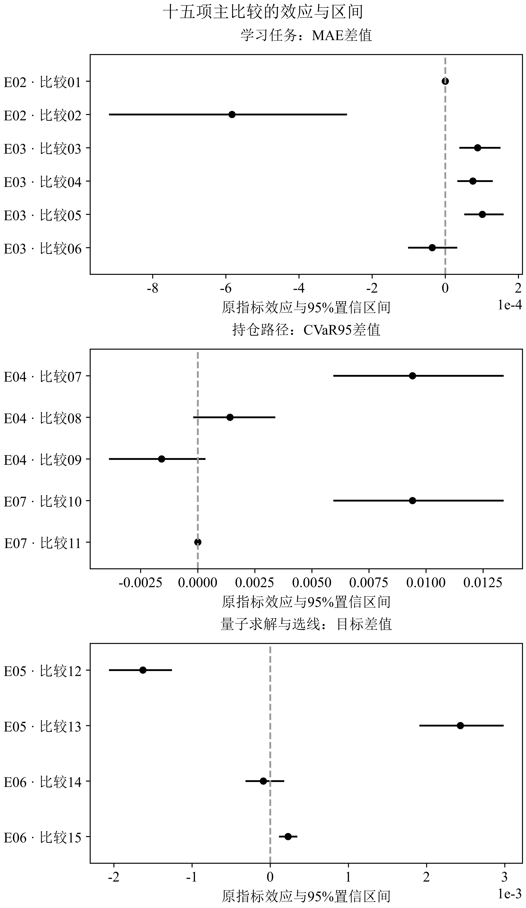

# 案例 02 · 保真度核、量子局部特征与受控比较

[English](02-representations.md) · [研究地图](../research_zh.md) · [配套笔记本](../../notebooks/02_representation_evidence.ipynb)

## 本案例要学会什么

本案例沿着源码和证据追踪两种量子表示：E02 在五期下行风险任务中使用**以锚点为中心的保真度核特征**；E03 在股票收益任务中使用**局部可观测量特征和经典图预测头**。随后检查表示层的差异传到组合决策层后发生了什么。两个任务都出现“量子”一词，并不意味着它们的目标、模型、样本单位或结论可以直接合并。

先修知识包括向量与内积、基本量子态、监督回归，以及训练/验证/测试划分。建议先读[案例 01](01-objective_zh.md)理解组合目标。公开[笔记本](../../notebooks/02_representation_evidence.ipynb)只读取并核对已选证据，不重新训练历史模型。

## 1. 已实现的电路候选族

[特征源码](../../algorithm/qf_algorithm/legacy/quantum_features.py)定义了六量子比特上的 12 个冻结映射。候选在一层/两层、输入缩放 $`\lbrace 0.5,1,1.5\rbrace `$、CZ/受控 RY 链之间变化。每层施加依赖输入的 RY 与 RZ 旋转，第一层先施加 Hadamard 门。量子参数冻结，训练的是经典预测头。

对归一化的六维输入 $`x`$，可写为

```math
|\psi_\theta(x)\rangle=U_\theta(x)|0\rangle^{\otimes6},\qquad
\rho_\theta(x)=|\psi_\theta(x)\rangle\langle\psi_\theta(x)|。
```

这里 $`\theta`$ 表示一个候选配置。在有限目录中选择候选是已经实现的模型选择流程。若要进一步研究量子核自设计，还需明确结构搜索空间、可训练参数或结构变换、选择目标、搜索预算和留出集评估；当前证据支持的是已登记的候选目录比较。

### E02：用保真度核表示相似性

实现中的 `fidelity_kernel` 计算

```math
k_\theta(x,x')=|\langle\psi_\theta(x)|\psi_\theta(x')\rangle|^2
=\mathrm{Tr}[\rho_\theta(x)\rho_\theta(x')]。
```

对于归一化的理想态，有 $`0\leq k\leq1`$ 且 $`k(x,x)=1`$。其 Gram 矩阵半正定，因为对任意实系数 $`c_i`$，

```math
\sum_{ij}c_ic_jk(x_i,x_j)=\left\|\sum_i c_i\rho(x_i)\right\|_{\mathrm{HS}}^2\geq0。
```

独立噪声估计的核元素未必仍满足这一性质。实测核研究应说明对称化、对角线处理和 PSD 修正，并把这些操作纳入方法成本。

[E02 实现](../../algorithm/qf_algorithm/legacy/run_e02.py)从训练行中选取 32 个锚点，每个样本表示为

```math
\Phi_\theta(x)=\big[k_\theta(x,a_1),\ldots,k_\theta(x,a_{32})\big]。
```

这叫作以锚点为中心的保真度特征。源码将其交给标准化的 `SGDRegressor`；它没有进行锚点 Gram 矩阵的逆平方根变换，因此不应把它称作未经证明的 Nyström whitening。经典对照使用 $`\exp(-\|x-a_j\|^2/6)`$，并使用同一个预测头。三个开发折从 12 个候选中选择，最终头部用五个随机种子评估。输入标准化只在训练行上拟合，然后裁剪到 $`[-3,3]`$ 并乘以 $`\pi/3`$。

原始运行计算精确 statevector，并将重叠计算复用为经典缓存。有限采样分析从这些精确重叠中以 256、1,024 和 4,096 shots 进行二项采样。这些条目是**本地采样估计器**的证据；硬件等效 pair 预算是成本模型，不能写成实际设备调用次数。源码同时记录锚点 Gram 最小特征值，并在精确计算中记录 PSD 修正范数为零。

### E03：把可观测量特征交给图预测头

同一电路族还产生另一种表示：

```math
\phi_\theta(x)=\big(\langle Z_0\rangle,\ldots,\langle Z_5\rangle,
\langle Z_0Z_1\rangle,\ldots,\langle Z_4Z_5\rangle\big)\in\mathbb R^{11}。
```

11 个读出包括 6 个单比特 Z 期望值和 5 个相邻 ZZ 期望值，共用一个 Z 基测量设置。实现明确区分 SDK 的 `q5...q0` 比特串与 `q0...q5` 读出顺序；顺序反转会在维度不变的情况下静默改变图特征。

[图预测头](../../algorithm/qf_algorithm/legacy/graph_head.py)执行经典图聚合。一层可以写成

```math
H_1=\tanh(A\Phi W_1+b_1),\qquad \widehat y=H_1W_o+b_o，
```

两层版本再对 $`H_1`$ 进行一次 $`A H_1`$ 聚合。可训练权重属于预测头。完整资产图保存在经典内存中，局部量子寄存器只有 6 个量子比特；资产数、寄存器大小、输入编码次数和测量 shots 是不同的资源维度，不能用一个数字代替。

## 2. 尊重信息时钟

标签只有在结果已知后才可使用。E02 的开发折按 `label_end` 过滤；五期下行目标属于它自己的任务契约。新版[标准化面板](../../algorithm/qf_algorithm/data.py)与[pipeline](../../algorithm/qf_algorithm/pipeline.py)明确追踪下一开盘至后续开盘任务的标签可用时间，并在评估窗口前剔除尚未成熟的训练标签。

一个简单的信息时钟是：在 $`t`$ 日收盘形成信号，下一开盘进入，再下一开盘退出，退出发生后才接纳标签。五期目标需要更长的可用时间窗口。源码版本与信息契约必须随结果一起保存；今天修改 pipeline 不会重新评估历史实验。

公平比较要固定输入信息、目标、日期切分、开发预算和头部容量。在同一任务下，可比较正向、反向、只保留自身和随机图结构。要隔离预期收益特征，固定协方差估计；要隔离风险估计，固定收益模型。记录预先声明的比较族、校正方式和重采样单位。

## 3. 按任务阅读归档结果

| 字段 | E02 保真度核映射 | E03 局部可观测量消息 |
|---|---|---|
| 目标 | 五期未来下行风险，原始年化尺度 | 登记的下一开盘任务中的股票收益 |
| 量子表示 | 与 32 个训练锚点的相似度 | 11 个可观测量特征，经典图预测头 |
| 观测量 | 576 个日期、3,456 个资产-日期对、5 个种子 | 485 个共同日期、5 个种子 |
| 主要对比 | 选中映射减经典映射 | 局部消息减验证选择的经典图 |
| MAE 差异 | `−0.0005830381` | `+0.0000883367` |
| 归档 95% 区间 | `[−0.0009172197, −0.0002712622]` | `[0.0000409374, 0.0001486703]` |
| 任务内结论 | 选中量子映射误差更低 | 该任务中量子局部消息误差更高 |

[E02](../../evidence/E02.json)与[E03](../../evidence/E03.json)保留配对的平稳时间块过程和种子聚合。E02 使用冻结块长 80 和 2,000 次重采样。日期序列具有时间依赖；五个模型种子不是五条独立金融历史。E02 选中映射与固定映射的端点完全相同，E03 选中与固定的方向实现也在归档输出中相同。因此，不能把结果差异简单归因于“搜索了架构”。



*原始图像从归档统计复算中逐字节复制，未重绘。实心位置是效应估计，横线是归档区间；[图示说明](../../assets/original/README.md#numbered-comparisons-in-the-effects-figure--效应图编号)把 15 个编号映射到实验和比较键。MAE、CVaR95 和目标差距是不同端点，即使 E02 与 E03 都报告 MAE，其目标尺度也不同。每行要以自己的零线解释。*

方向控制同样限制解释：E03 方向减自身为正，方向减反向为正，方向减随机的区间跨过零。归档证据没有证明量子方向消息改善这些控制。

## 4. 预测质量必须经受决策层检验

令期间损失为 $`L_t=-r_t`$，置信水平为 $`\alpha`$ 的经验 CVaR 可以写成

```math
\widehat{\mathrm{CVaR}}_\alpha(L)=\min_\eta\left[\eta+
\frac{1}{(1-\alpha)T}\sum_t\max(L_t-\eta,0)\right]。
```

具体样本约定应以登记实现为准。对损失端点，CVaR 越低越有利。一个很小的 MAE 变化可能改变排序、持仓、换手和尾部损失；其符号不能预先决定金融端点。

[E04](../../evidence/E04.json)分别改变收益均值与风险估计。在主要端点上，量子均值减经典均值的 CVaR 为 `+0.0094119182`，区间 `[0.0059764443, 0.0133643372]`。因子减收缩为 `+0.0014133302`，区间 `[−0.0001619626, 0.0033556581]`。量子风险减因子为 `−0.0015807364`，区间 `[−0.0038498930, 0.0002968482]`。后两个区间跨过零，不能只凭点估计宣称改善。

整合的[E07](../../evidence/E07.json)使用 485 个持仓区间和 5 个种子。在成本 `0.001` 下，完整方法的平均种子 CVaR95 为 `0.0369492238`，经典方法为 `0.0275373056`，主要差异与 E04 均值对比相同且不利于完整方法。完整与固定映射输出相同。E07 复用已有量子特征，新增量子/硬件调用数记录为 0；分数持仓、只做多、复权价格总收益代理与执行代理限定了离线评估范围。

## 5. 可执行的下一项贡献

选择以下一项并附上[贡献记录](../contributions_zh.md#贡献记录模板)：

1. 跟踪 `fidelity_kernel` 到 E02 的锚点、缩放器和预测头，说明哪些操作使用训练数据，以及未来实测核估计器应插入哪里。
2. 从 Z 基比特顺序追踪一个 E03 特征，经图聚合到一个端点，检查单位并指出最强的匹配经典对照。
3. 审核一个 E04 对比：标出改变的是均值还是协方差，连接到换手和 CVaR 字段。

**阅读检查。** 为什么是 11 个可观测量？6 个 Z 加 5 个相邻 ZZ。精确保真度 Gram 为什么半正定，而估计矩阵可能不半正定？因为逐元素采样误差未必来自同一个共同特征嵌入。选中等于固定说明什么？该端点没有显示目录选择带来的增益。E02 的 MAE 能否和 E03 数值直接比较？不能，因为目标尺度不同。

仍然开放的研究方向包括任务感知核设计、匹配容量的局部量子特征、搜索预算控制和硬件感知表示。新研究应先冻结任务和经典对照，核算态制备、测量和搜索资源，并保留留出日期。

## 来源与延伸阅读

- [量子特征定义](../../algorithm/qf_algorithm/legacy/quantum_features.py)、[E02 源码](../../algorithm/qf_algorithm/legacy/run_e02.py)、[图预测头](../../algorithm/qf_algorithm/legacy/graph_head.py)、[风险估计](../../algorithm/qf_algorithm/risk.py)。
- Havlíček 等，*Supervised learning with quantum-enhanced feature spaces*，Nature 567 (2019)，[DOI](https://doi.org/10.1038/s41586-019-0980-2)。
- Schuld 与 Killoran，*Quantum Machine Learning in Feature Hilbert Spaces*，Physical Review Letters 122 (2019)，[DOI](https://doi.org/10.1103/PhysRevLett.122.040504)。
- [原始图来源](../../assets/original/README.md)、[证据范围](../../evidence/README_zh.md)、[论文与研究写作](https://github.com/Soros2040/julius-future/tree/main/works)。
