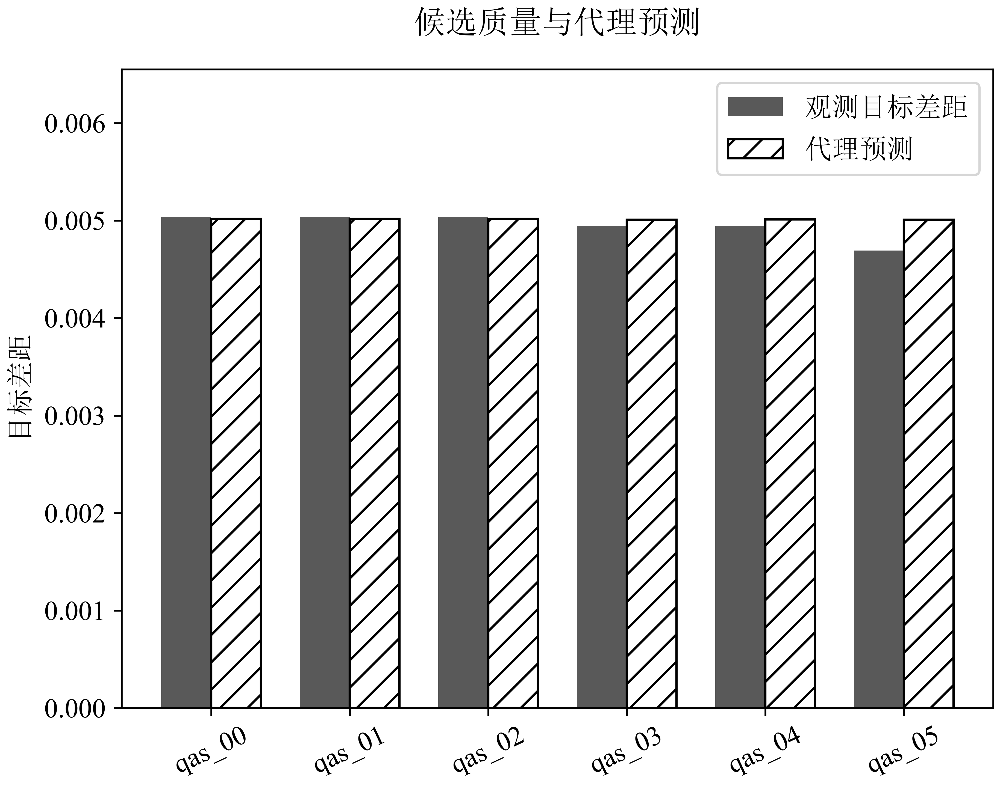
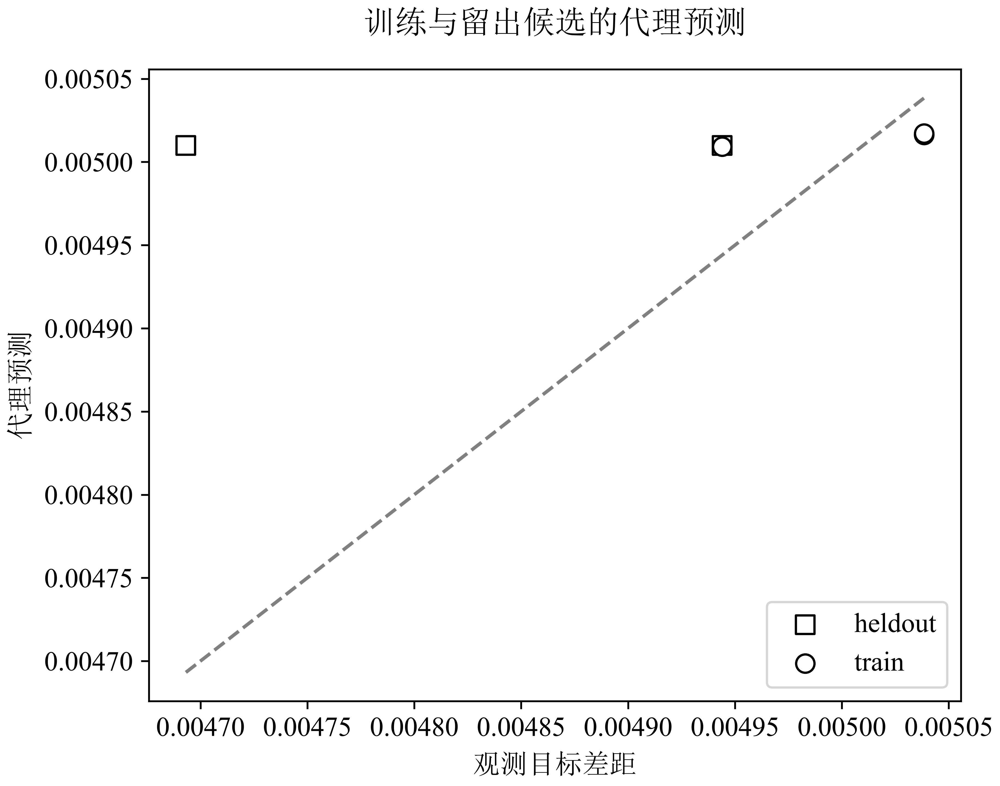
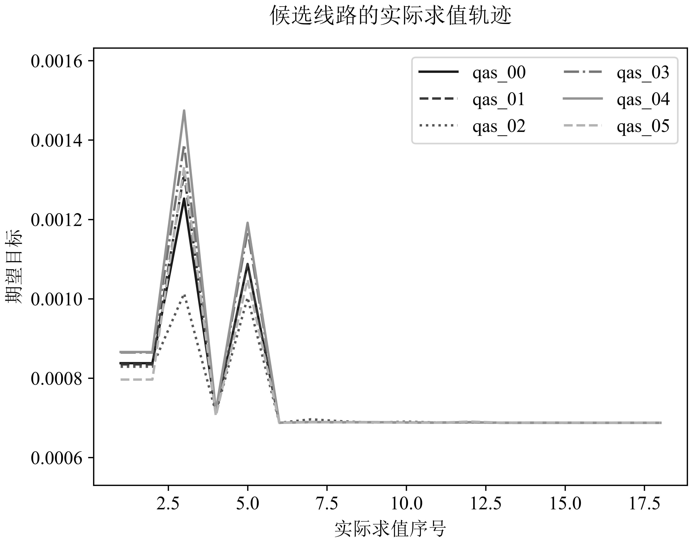

# Case 03 · Explain the gap between ideal circuits and hardware

[中文](03-hardware_zh.md) · [Research map](../research.md) · [Notebook](../../notebooks/03_hardware_transfer.ipynb)

## What this case teaches

Follow candidate scoring into circuit execution, then separate optimizer behavior, sampling variation, model mismatch and hardware transfer. This case joins two evidence routes: a small archived **synthetic software-integration example**, and the **historical matched hardware study**. Each image retains its original source identity; their numerical results answer different questions.

Prerequisites: the objective in [Case 01](01-objective.md), probability distributions, basic quantum circuits and train/held-out separation. The companion notebook aggregates public evidence. Source reading and image inspection are sufficient for this case; external device execution requires a separately defined study.

## 1. Learn from an existing candidate-selection example

The [selection source](../../algorithm/qf_algorithm/selection.py) fits a standardized ridge proxy to a whitelist of candidate features. Abstractly, for training candidates with features $`z_i`$ and measured local quality $`g_i`$,

```math
(\widehat b,\widehat w)=\arg\min_{b,w}\sum_{i\in\mathcal T}(g_i-b-\widetilde z_i^Tw)^2+\alpha\|w\|_2^2.
```

Standardization is fitted on training candidates, and the ridge strength is selected by leave-one-candidate-out scoring. A predicted score can rank candidates only to the extent that these small data identify useful relationships. Evaluating a training candidate and predicting a held-out candidate are different checks.

The three images below come from one original synthetic integration record: 25 training dates, 10 evaluation dates, six candidates, 1,024 local shots each (6,144 total), and a four-candidate training/two-candidate holdout split for the proxy. Its QAOA mode is `optimize`; the prediction model records 40 epochs. This is a method-chain demonstration with normalized synthetic input, separate from historical E06 and from physical hardware.



*Filled bars show observed objective gap; hatched bars show the proxy prediction. Smaller gap is preferable within this frozen objective. The nearly constant predictions around 0.005 fail to capture the especially low observed value of qas_05, around 0.0047. A ranking decision is an inspectable hypothesis about candidate quality.*



*Circles denote training candidates and squares held-out candidates; the diagonal is exact agreement. Four training examples are too few to infer broad predictive reliability. The selected order recorded for this demonstration is qas_03, qas_05, qas_04, qas_00, qas_01. This order describes one software output, not an established optimum for other tasks.*



*The horizontal axis is the actual objective-evaluation index. It is not the number of training epochs. Optimizer trial evaluations can increase temporarily; final candidate traces plateau near one another. The plot documents local optimizer behavior and alone establishes neither global optimality nor hardware performance.*

The selector constrains an optional LLM decision to a frozen candidate bundle and enumerated reason codes. The LLM interface is an orchestration aid: scientific credit for a selection method still requires a shared candidate set, held-out problems, equal search budget and a quality/cost comparison. A valid response schema does not establish a better circuit.

### Historical E06 answers a separate selection question

[E06](../../evidence/E06.json) compares fixed, resource-only and noise-aware selection on eight base problems, with five candidates, five seeds and four noise profiles in the aggregated record. Noise-aware minus fixed has effect `−0.0000877088`, interval `[−0.0003046350, 0.0001685689]`; the archive does not establish improvement over fixed selection. Noise-aware minus resource-only is `+0.0002280378`, interval `[0.0001235246, 0.0003344793]`, favoring the resource-only reference for this gap endpoint.

Candidate count, training-proxy error and final task quality should therefore be reported separately. The original integration figures illustrate failure mechanisms worth auditing, while E06 supplies the historical registered comparison.

## 2. The matching problem

A hardware result is interpretable only when its logical circuit, parameters, physical mapping, measurement order, shots and device calibration are identified. A device's advertised register size says little about the size or quality of the experiment. This study uses six-qubit circuits on the Tianyan-287 platform.

The archived transfer study has 500 local-message circuits and 500 QAOA circuits, each measured 1,024 times. Real-hardware coverage is therefore 1,024,000 shots. Matching cloud noisy simulation returned 999 valid circuits and one terminal failure, yielding 1,022,976 valid cloud shots. Its comparisons retain the 999 matched hardware records rather than pretending both samples contain 1,000 circuits.

## 3. Five distributions answer different questions

| Distribution | What it holds fixed | What changes |
|---|---|---|
| Ideal statevector | Frozen compiled task and parameters | Exact probability reference |
| Finite-shot ideal | Same ideal probabilities | Sampling at the recorded shot count |
| Local noise model | Recorded noise assumptions | Channel evolution without device execution |
| Cloud noise model | Matched submitted circuit | Provider implementation and finite shots |
| Real hardware | Submitted physical circuit and mapping | Device behavior under the observed calibration |

For normalized distributions $`p,q`$, total variation is $`\mathrm{TV}(p,q)=\frac12\sum_x|p(x)-q(x)|`$. Hellinger distance is $`H(p,q)=\sqrt{\frac12\sum_x(\sqrt{p(x)}-\sqrt{q(x)})^2}`$. The public tables distinguish $`H`$ from $`H^2`$. For the three-holding constraint, define $`\mathcal F=\lbrace x:\sum_i x_i=3\rbrace `$. Then

```math
P_F=\sum_{x\in\mathcal F}p(x),\qquad
G_F=\frac{\sum_{x\in\mathcal F}p(x)[f(x)-f^*]}{P_F}.
```

The conditional gap $`G_F`$ is defined only when $`P_F>0`$. Report feasibility beside the conditional gap: a distribution that produces good baskets rarely has a different operational value from one that does so consistently. An optimal sample alone does not characterize the distribution. For zero feasible counts, preserve that failure rather than substituting a favorable conditional value.

## 4. What the archive shows

| Metric, mean over family | Message (500 hardware circuits) | QAOA (500 hardware circuits) |
|---|---:|---:|
| Compiled depth | 48.00 | 419.08 |
| Two-qubit gates | 29.00 | 179.88 |
| Hardware vs ideal TV | 0.16652 | 0.88700 |
| Hardware vs local-noise TV | 0.15623 | 0.23501 |

The QAOA family's hardware feasibility is about **31.51%**, versus **100%** for its ideal reference and **35.22%** for the local-noise model. The larger compiled depth and two-qubit workload motivate a noise analysis, but this table alone does not establish a causal depth effect.

The [hardware table](../../evidence/hardware-per-circuit.csv) retains all 1,000 rows. The [cloud table](../../evidence/cloud-per-circuit.csv) retains 999 matched rows, including 499 QAOA rows. Means over those 499 records are slightly different from the full 500-row hardware summaries. Always choose the population before quoting a value.

## 5. Statistical scope and provenance

The archive observed one hardware calibration snapshot. Its 2,000-resample bootstrap uses original five-circuit submission blocks within family. These are conditional descriptive intervals for this circuit collection and calibration; submission batches are not independent device calibrations.

The original records retain request/receipt lineage and counts reconciliation. The public edition contains selected numeric fields and source-summary SHA-256 values; provider handles and private execution metadata remain in the source archive. An archived [independent numerical implementation check](../../evidence/independent-numerical-check.json) reports differences below `1e-11`, with observed maxima around `5.6e-16`. That was a second implementation in the same analysis task, not an external replication.

The notebook and [public evidence checker](../../tools/verify_public_evidence.py) independently aggregate published rows. They do not query a device or regenerate provider receipts. See [reproduction status](../status.md) for the current archive limits.

## 6. Source and next contributions

The product's [hardware policy](../../product/apps/control-plane/src/hardware-policy.ts) separates read-only checks from submission permission. The [Tianyan worker](../../product/workers/quantum/src/qf_quantum_worker/tianyan_job.py) keeps submission and querying explicit; the algorithm's [receipt audit](../../algorithm/qf_algorithm/governance.py) validates archived contracts. The [historical analysis implementation](../../algorithm/qf_algorithm/legacy/hardware_matched_analysis.py) documents the paired analysis.

A stronger next experiment would freeze a matched low/deep circuit set, repeat across independent calibration windows, retain all failed jobs, and compare target quality alongside TV, feasibility and resource cost. It requires a new execution budget and has not been performed by this publication workflow.


### Reading checks and contribution tasks

1. Reconcile `500 + 500 = 1,000` hardware circuits and `1,000 × 1,024 = 1,024,000` shots. Reconcile `500 + 499 = 999` valid cloud circuits and `999 × 1,024 = 1,022,976` shots. Identify the excluded circuit when making a paired analysis.
2. Explain why a 31.51% feasibility rate and a conditional feasible objective measure different quantities. Locate both in the historical source before summarizing optimizer quality.
3. Review the three proxy figures against the [figure provenance index](../../assets/original/index.json). Distinguish prediction error, candidate ordering and objective traces. Record a limitation that a new candidate-level holdout could address.
4. Propose a matched comparison across independent calibration windows. Specify the frozen circuits, failed-job handling, calibration grouping, device resources and task-quality endpoint before requesting execution.

**Answer checks.** Six logical qubits is the experiment width even though the platform is called Tianyan-287. A five-circuit submission block is not an independent calibration. One fewer valid cloud QAOA circuit changes the matched population. A lower TV distance means closer distributions under that metric; it does not automatically mean lower portfolio loss. A proxy trained on four candidate examples cannot support a broad generalization claim.

### Primary sources and writing

- [Original images and their exact-copy provenance](../../assets/original/README.md), [hardware evidence](../../evidence/hardware.json), [cloud evidence](../../evidence/cloud.json).
- [Proxy and decision constraints](../../algorithm/qf_algorithm/selection.py), [circuit/count metrics](../../algorithm/qf_algorithm/quantum.py), [historical paired analysis](../../algorithm/qf_algorithm/legacy/hardware_matched_analysis.py).
- Preskill, *Quantum Computing in the NISQ era and beyond*, Quantum 2, 79 (2018), [DOI](https://doi.org/10.22331/q-2018-08-06-79).
- [Related manuscripts and research writing](https://github.com/Soros2040/julius-future/tree/main/works).
